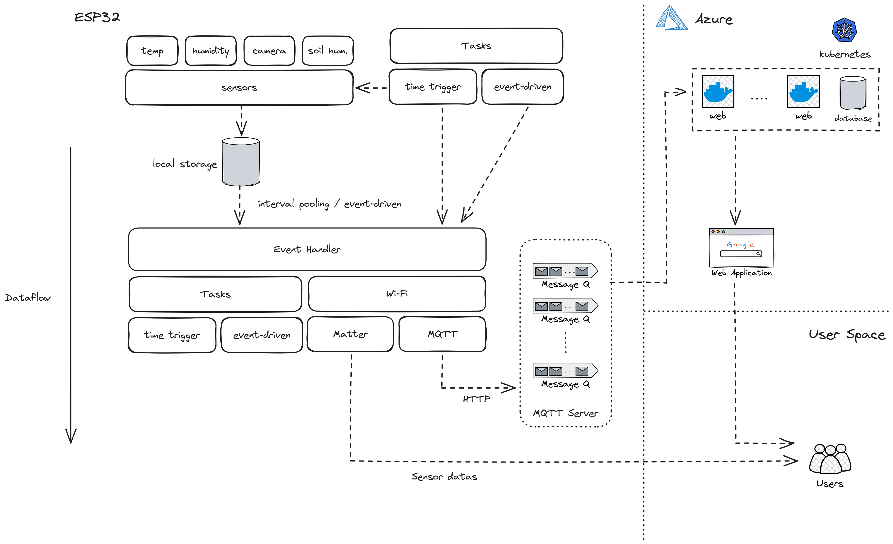

# Stargazer

## Purpose

근래 도시 농업에 대한 관심이 커지고 있습니다. 농촌진흥청에 따르면 현재 도시농부의 수는 200만명을 넘어섰고, 그 경제적 가치 또한 3조원을 돌파하였습니다. 현재 도시 농업은 주로 기초자치단체에서 임야을 대중에게 대여하는 방식으로 운영되고 있습니다. 도시 농업이 급속하게 규모를 키워가는 가운데, 파생되는 문제점도 점차 대두되고 있습니다.

발생되는 문제들 중 하나는 야생동물에 의한 피해입니다. 기초자치단체에서 운영하는 텃밭은 주로 도시 외곽, 산과 인접한 곳에 위치합니다. 이러한 위치는 고라니, 멧돼지 등의 거주 반경과 겹치는 경우가 상당합니다. 따라서 굶은 야생 동물들이 도시 텃밭으로 내려와 작물을 섭취거나 짓밟는 사례가 증가하고 있습니다. 이를 해결하기 위해 예산을 투자하여 시설을 증축할 수 있지만, 주 관리 주체인 기초자치단체는 관리할 역량이 충분하지 않습니다. 또한 도시 텃밭을 대여받는 사람은 1년 단기 계약에 야생 동물 퇴치 시설같은 고정비를 투자하지 않으려 합니다.

또한, 주거지와 텃밭의 거리가 멀다는 점도 문제점으로 지적됩니다. 기초자치단체는 남는 임야에 적당한 땅을 선정하여 도시 텃밭으로 지정합니다. 주로 주거지와는 도보로 오고가기에 적합하지 않는 지역입니다. 거리가 멀 수록 경작자들의 발걸음은 소원해질 수 밖에 없습니다. 결국 관리 소홀은 전체 텃밭 미관을 해칠 것입니다.

이러한 문제들을 해결하기 위해, IoT 기반 시스템을 개발, 구축하고자 합니다. 우리가 소개하고자 하는 IoT 기반 시스템 **Stargazer**는 별을 보는 사람이라는 뜻을 품었습니다. 본인이 밭에 있지 않아도 작물을 대신 바라보는 자라는 생각으로 시스템 이름을 지었습니다.

## Development Goals

Stargazer는 다음 몇 가지 기술 과제를 해결하고자 합니다.

- **Matter Protocol Implementation:** Matter Protocol을 도입하여 광범위하게 사용되는 IoT 허브에 상호호환되는 시스템을 구축하고자 합니다.
- **Sensors:** 농업에 유용하게 이용할 수 있는 지표를 각종 센서를 이용해 제공하고자 합니다. 사용할 센서는 다음과 같습니다.
	- 온도 센서
	- 습도 센서
	- 토양 습도 센서
	- 카메라

## Architectures

## Directories

| **Directory** |  **Content** |
|---|---|
| docs | 개발에 필요한 문서, 방법 등을 기록 |
| src | 소스 코드 |

