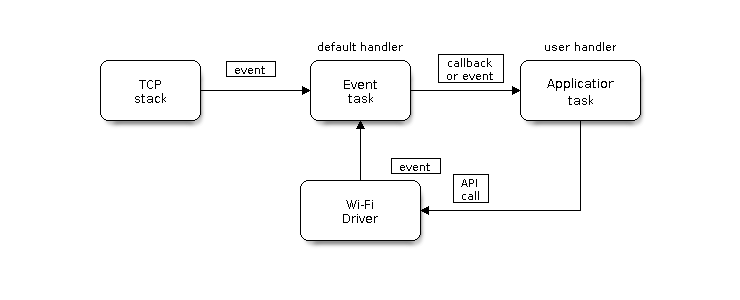

# ESP-IDF

## Events

- [Event loop documentation](https://docs.espressif.com/projects/esp-idf/en/latest/esp32/api-reference/system/esp_event.html)

## Wi-Fi



### Wi-Fi Station

- [ESP32 Wi-Fi Station General Scenario](https://docs.espressif.com/projects/esp-idf/en/latest/esp32/api-guides/wifi.html#esp32-wi-fi-station-general-scenario)

### Wi-Fi Aware

- [Wi-Fi Aware Documentation](https://docs.espressif.com/projects/esp-idf/en/latest/esp32/api-reference/network/esp_nan.html)

## MQTT

- [MQTT Documentation](https://docs.espressif.com/projects/esp-idf/en/latest/esp32/api-reference/protocols/mqtt.html)

## Log

- [Log Library Documentation](https://docs.espressif.com/projects/esp-idf/en/latest/esp32/api-reference/system/log.html)

## idf.py

### create-project

esp-idf 프로젝트 생성

```shell
idf.py create-project [project_name]
```

### create-project-from-example

esp-idf example 코드를 가져와 프로젝트를 생성한다. `namespace/name=1.0.0:example` (ex. `example/cmp^3.3.8:cmp_ex`) 꼴로 명령어 뒤 인자로 입력하여 예제 프로젝트를 지정한다.

```shell
idf.py create-project-from-example namespace/name=1.0.0:example
```

### menuconfig

Kconfig와 sdkconfig로 프로젝트 설정값을 관리한다. git 형상 관리를 위해 적당한 `sdkconfig` 값을 우선적으로 설정한다. 이후 `sdkconfig.default`로 내보내 git에 저장하고 `sdkconfig`를 `.gitignore`에 등록하여 사용한다.

```shell
idf.py menuconfig
```